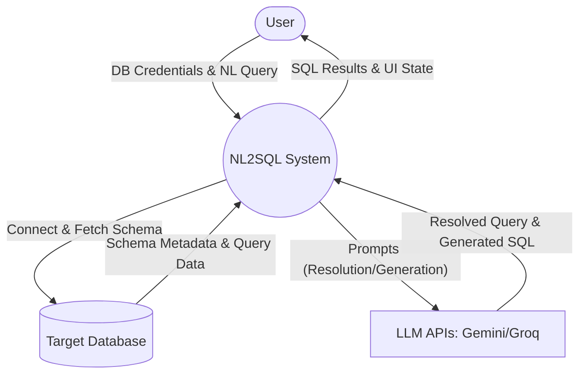
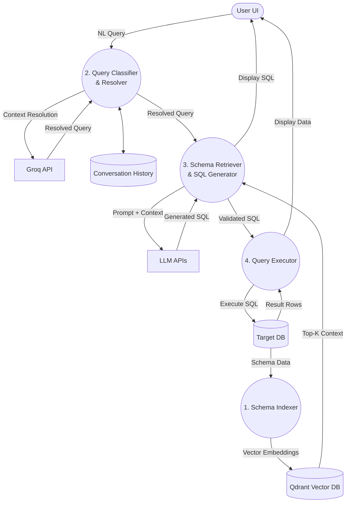
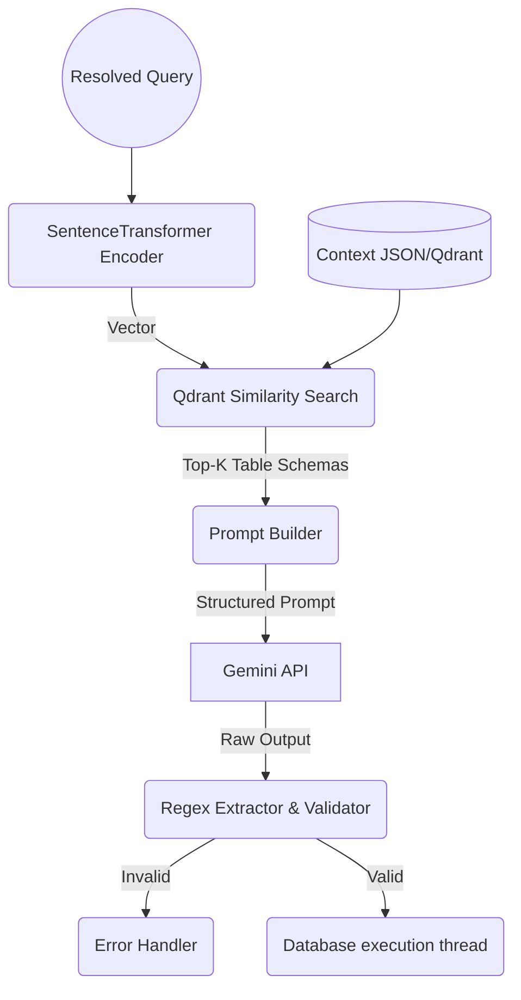
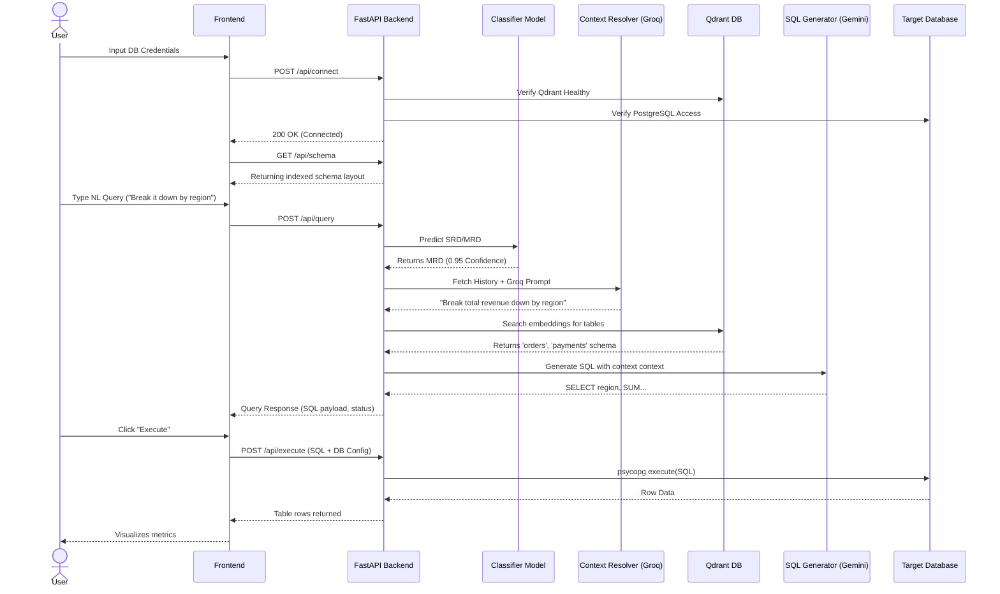

# System Architecture & Diagrams

Below are the conceptual breakdowns and Mermaid.js visualizations for your NL2SQL pipeline, assuming a fully integrated production environment where schemas are actively indexed and queries are generated and executed.

---

## 1. Data Flow Diagrams (DFD)

### Level 0 DFD (Context Diagram)
The Level 0 DFD shows the system as a single high-level process interacting with external entities.

*   **External Entities:** User (Frontend), External Database (PostgreSQL/Target DB), LLM APIs (Gemini, Groq).
*   **System:** NL2SQL System.
*   **Flow:** 
    * User inputs Database Credentials -> System.
    * System retrieves Schema -> Target DB.
    * User inputs Natural Language Query -> System.
    * System sends/receives context and prompts -> LLM APIs.
    * System executes SQL -> Target DB.
    * System returns SQL and Data Results -> User.



### Level 1 DFD (Logical Sub-Systems)
Breaks down the main system into primary functional modules (Data Ingestion, ML Pipeline, Execution).

*   **Processes:** 
    1. Schema Collector & Indexer
    2. Query Classifier & Context Resolver
    3. Schema Retriever & SQL Generator
    4. Query Executor
*   **Data Stores:** Conversation History (Memory), Qdrant Vector DB (Schema Embeddings).



### Level 2 DFD (ML Pipeline Breakdown - Process 2 & 3 Expansion)
Shows the exact mechanics inside the inference layers.



---

## 2. UML Component Diagram

This models the static architecture of your production deployments, outlining how the fastAPI backend orchestrates the inner ML components and external persistence stores.

```mermaid
componentDiagram
    package "Client Layer" {
        [Frontend App (HTML/JS)]
    }

    package "API Layer (FastAPI)" {
        [Main Server]
        [db_service]
        [engine_service]
    }

    package "Engine (ML Core)" {
        [Classifier (scikit-learn)]
        [Context Resolver (Groq)]
        [Schema Retriever (HuggingFace)]
        [NL2SQL Generator (Gemini)]
    }

    package "Infrastructure & APIs" {
        database "Qdrant Vector DB" {
            [Schema Sub-Collections]
        }
        database "Target Database" {
            [PostgreSQL]
        }
        cloud "External LLMs" {
            [Groq Server]
            [Google GenAI]
        }
    }

    [Frontend App (HTML/JS)] ..> [Main Server] : HTTP/REST
    [Main Server] --> [db_service] : Validates & Executes
    [Main Server] --> [engine_service] : Handles inference routes
    
    [engine_service] --> [Classifier (scikit-learn)] : Predict SRD/MRD
    [engine_service] --> [Context Resolver (Groq)] : Generate standalone query
    [engine_service] --> [Schema Retriever (HuggingFace)]
    [engine_service] --> [NL2SQL Generator (Gemini)]
    
    [Context Resolver (Groq)] ..> [Groq Server] : REST
    [NL2SQL Generator (Gemini)] ..> [Google GenAI] : REST
    [Schema Retriever (HuggingFace)] ..> [Schema Sub-Collections] : gRPC/HTTP
    [db_service] ..> [PostgreSQL] : TCP (psycopg)
```

---

## 3. Sequence Flow (Inference Execution Diagram)

The sequence diagram reflects the exact synchronous nature of a user pressing "Run Query" in the UI.


